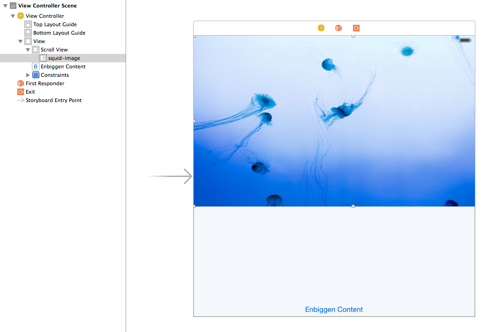

A subview in scroll view would revert back to IB's frame settings after scroll:

The storyboard has an image view inside a scroll view. It looks like this:

This problem persists even after removing the generated width and height constraints for the subview in viewDidAppear.

It does this even though the subview's constraints is empty.

# Workaround

Programatically adding the UIImageView to the UIScrollView works.
